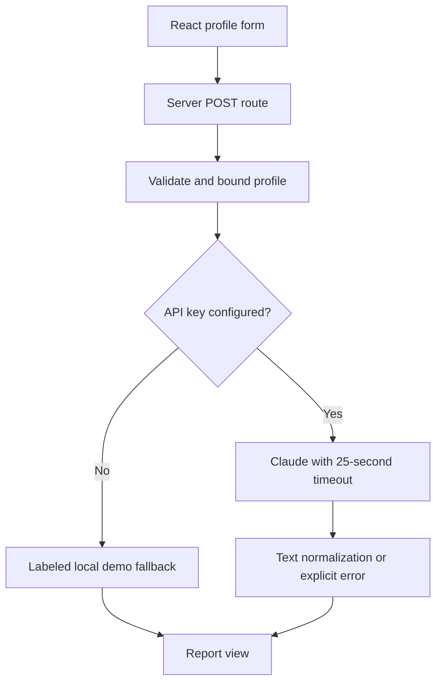

# InsightForge AI — Personalized Career Report

A production-style **Next.js AI application** that turns a short career profile into a structured career-growth report using the **Anthropic Claude API**.

**Live demo:** https://personalized-ai-report.vercel.app

## Why I built this

The goal was to build a small AI product that demonstrates more than a client-side model call. The app keeps provider credentials on the server, validates user input, handles provider failures, returns a predictable report structure, and still works locally without an API key through a deterministic fallback.

## What it demonstrates

- Server-side LLM integration with Anthropic Claude
- API-key isolation — provider credentials never reach the browser
- Input validation and length limits
- Provider timeout and error handling
- Structured prompt/output contract
- Responsive React UI
- Local fallback behavior for development/demo use
- Production deployment with Vercel

## Architecture

```text
User
  |
  v
Next.js / React UI
  |
  | POST /api/generate
  v
Server-side API route
  |
  +--> Validate + normalize input
  |
  +--> ANTHROPIC_API_KEY available?
          |
          +--> Yes --> Anthropic Messages API --> Parse text blocks
          |
          +--> No  --> Deterministic local fallback
  |
  v
Structured career report
  |
  v
React result view
```

## Request flow

The client collects six fields:

- name
- current role
- years of experience
- career goal
- strengths
- biggest challenge

The server route then:

1. validates the request body
2. trims and bounds user-provided text
3. validates the numeric experience range
4. builds a constrained prompt
5. calls Anthropic with a 25-second timeout
6. normalizes the returned text (the report is plain text, not schema-validated JSON)
7. returns a report containing:
   - Snapshot
   - Strongest Advantages
   - Gaps To Close
   - 30-Day Plan
   - Next Move

## Tech stack

- **Next.js 16**
- **React 19**
- **JavaScript**
- **Anthropic Messages API**
- **Vercel**

## Project structure

```text
app/
├── api/
│   └── generate/
│       └── route.js      # thin POST adapter
├── globals.css           # application styling
├── layout.js             # app layout/metadata
└── page.js               # form, API request, loading/error/result UI
```

## Run locally

```bash
git clone https://github.com/tejaswaroop999/personalized-ai-report.git
cd personalized-ai-report
npm install
cp .env.example .env.local
```

Add your Anthropic key:

```env
ANTHROPIC_API_KEY=your_key_here
```

Optional:

```env
CLAUDE_MODEL=claude-sonnet-4-6
```

Then run:

```bash
npm run dev
```

Open http://localhost:3000.

If `ANTHROPIC_API_KEY` is not configured, the app uses a local deterministic fallback so the full UI flow can still be tested.

## Tests and CI

```bash
npm test
npm run build
```

The Node test suite covers zero experience, deterministic fallback, malformed JSON, missing/invalid fields, input bounds, provider request construction, text normalization, non-success responses, invalid/empty output, and timeout/network errors. Provider calls are mocked; tests do not require keys or spend API credits. GitHub Actions runs tests and the production build.

The route delegates to `lib/generate-report.mjs`, keeping the API logic testable with standard Request/Response objects. The invalid `next lint` script has been removed; no lint check is claimed.

## Screenshots and demo recording

The **Browser smoke checks and demo evidence** workflow starts the actual production build, exercises the no-key fallback at desktop (1440px) and mobile (390px) widths, and uploads `insightforge-demo-evidence`:

- Desktop and mobile form/report screenshots
- A desktop interaction recording (`desktop-demo.webm`)
- Capture context identifying the deterministic fallback

Open [Actions](https://github.com/tejaswaroop999/personalized-ai-report/actions/workflows/demo-evidence.yml), select a successful run, and download the artifact. These are actual browser captures, not generated mockups. The job verifies API success, all five report sections, reset behavior, page errors, and horizontal overflow. It makes no live Claude requests and needs no secrets.

For local capture, install Playwright separately with `npm install --no-save --package-lock=false playwright@1.62.1` and `npx playwright install chromium`, start the production app with no API key, then run `node scripts/capture-demo.cjs`. Evidence is written under `demo-evidence/`.

## API contract

`POST /api/generate` accepts `name`, `role`, `experience`, `goal`, `strengths`, and `challenge`. Text fields must be strings; experience may be a numeric string or a number from 0 to 70. Text is trimmed and truncated to 700 characters before prompt construction.

A successful response contains `title`, `provider`, and `report`. The report is plain text with five requested sections. Missing keys select the labeled local fallback. Provider failures never silently select that fallback.

| Status | Meaning |
| --- | --- |
| 200 | Claude report or explicitly labeled no-key demo fallback |
| 400 | Invalid JSON, required fields, types, or experience |
| 502 | Provider HTTP/network error or malformed/empty output |
| 504 | Provider request timeout |
| 500 | Unexpected internal failure |

## Architecture diagram



## Reliability and security choices

### Server-side provider call

The Anthropic request is made only inside the Next.js server route. The browser never receives the API key.

### Input validation

Required fields are validated and trimmed. User-controlled text is bounded before being included in the model prompt.

### Timeout handling

The external model call uses a request timeout so the server does not wait indefinitely on the provider.

### Provider failure handling

Non-success responses, network failures, malformed provider data, and empty model outputs return 502. Timeouts return 504. Provider error bodies and credentials are not exposed in API responses.

## Current limitations

This is intentionally a focused project rather than a complete SaaS platform. It does not currently include:

- authentication
- persistent report history
- rate limiting
- billing
- queues/background jobs
- tracing or LLM observability
- automated model-output evaluation

## Production roadmap

If scaling this into a larger product, I would add:

1. authentication and user accounts
2. persistent report storage
3. rate limiting and abuse protection
4. structured-output validation
5. prompt/model versioning
6. request tracing and observability
7. evaluation datasets for report quality
8. queue-based processing for longer jobs
9. usage/cost tracking
10. browser-level UI tests (API tests are implemented)

## Interview talking points

This project is useful for discussing:

- why LLM provider calls belong on the server
- how to validate user-controlled prompt inputs
- prompt contracts vs structured-output schemas
- handling latency and provider failures
- what changes when AI traffic scales
- rate limiting, queues, persistence, and observability
- evaluating model output quality rather than only checking API success

## Portfolio context

This public career-report app is distinct from any confidential commercial astrology/numerology report product. Commercial sales metrics should not be attributed to this repository.

The companion [LLM Evaluation Platform](https://github.com/tejaswaroop999/llm-evaluation-platform) explores repeatable output checks. These projects are not directly integrated. A future connection would use exact match for fallback fixtures and structural/rubric checks for generated reports.

## Author

**Teja Swaroop**  
Applied AI Engineer / Software Engineer

- LinkedIn: https://www.linkedin.com/in/tejaswaroop999/
- GitHub: https://github.com/tejaswaroop999

